# Iteration 1: Earnings Intelligence Dashboard

A LangGraph pipeline that processes earnings call transcripts and investor presentations, extracting structured metrics and forward-looking guidance into a rolling 8-quarter dashboard.

## Quick Start

### Prerequisites

- Python 3.11+
- Node.js 18+
- OpenAI API key

### 1. Backend

```bash
# From the repo root
cp .env.example .env  # Add your OPENAI_API_KEY (and optionally ARIZE_API_KEY, ARIZE_SPACE_ID)

# Install Python deps (use your project's venv)
pip install fastapi uvicorn langchain langchain-openai langchain-community pypdf pydantic

# Start the API server
cd mosaic-agentic-research-intelligence
python -m uvicorn iteration1.api:app --host 127.0.0.1 --port 8001 --reload
```

### 2. Frontend

```bash
cd iteration1/frontend
npm install
npm run dev
```

Open **http://localhost:5173** in your browser.

### 3. Using the Dashboard

1. Select a **Schema** from the sidebar dropdown (e.g., `hospital`)
2. Click a **Company** from the sidebar
3. Click **Run Pipeline** in the bottom status bar
4. Watch the progress bar as PDFs are processed
5. Switch between **Metrics Tracker** and **Guidance Tracker** tabs

## Project Structure

```
iteration1/
├── api.py                  # FastAPI backend
├── app.py                  # Gradio UI (legacy)
├── main.py                 # CLI entry point
├── pipeline.py             # LangGraph pipeline definition
├── state.py                # Pydantic models + pipeline state
├── storage.py              # SQLite persistence layer
├── prompts.py              # LLM prompt templates
├── pdf_parser.py           # PDF → page-tagged text
├── tracing.py              # Arize tracing setup
├── nodes/                  # LangGraph nodes
│   ├── classifier.py       # Document type classifier
│   ├── metric_extractor.py # LLM metric extraction
│   ├── metric_calculator.py# Derived metric formulas
│   ├── metric_validator.py # LLM validation checks
│   ├── metric_assembler.py # Rolling table assembly
│   ├── guidance_extractor.py # LLM guidance extraction
│   ├── guidance_delta.py   # Q-o-Q change detection
│   └── guidance_assembler.py # Guidance table assembly
├── schemas/                # Industry metric schemas
│   └── hospital.json
├── evals/                  # Evaluation framework
│   ├── code_evals.py       # 5 code-based evals
│   ├── llm_judge_evals.py  # 5 LLM judge evals
│   ├── arize_experiment.py # Arize experiment runner
│   ├── runner.py           # CLI eval runner
│   └── ground_truth/       # Ground truth templates
├── frontend/               # React + Vite + Tailwind
│   ├── src/
│   │   ├── App.jsx
│   │   ├── api.js
│   │   └── components/
│   │       ├── Sidebar.jsx
│   │       ├── MetricsTable.jsx
│   │       ├── GuidanceTracker.jsx
│   │       └── StatusBar.jsx
│   └── package.json
├── sample_docs/            # PDF files (not in git)
└── data/                   # SQLite databases (not in git)
```

## Running Evals

```bash
# Code-based evals (ground-truth-free)
python -m iteration1.evals.runner --suite code

# LLM judge evals
python -m iteration1.evals.runner --suite judge

# Both suites
python -m iteration1.evals.runner --suite all

# Upload to Arize
python -m iteration1.evals.runner --suite all --arize
```

## Sample Docs

Place PDF files under `iteration1/sample_docs/{company}/`:

```
sample_docs/
├── max/
│   ├── Q1_FY26_presentation.pdf
│   └── transcript/
│       └── Q1_FY26_transcript.pdf
├── apollo/
│   ├── Q2_FY26_presentation.pdf
│   └── transcript/
│       └── Q2_FY26_transcript.pdf
└── ...
```

PDFs are not checked into git due to size. Quarter is inferred from the filename (e.g., `Q1FY26`, `Q3_FY_25`).

## Architecture

### System Overview

```mermaid
flowchart TB
    subgraph INPUT["📄 Input Layer"]
        PDF["PDFs<br/><i>Presentations & Transcripts</i>"]
    end

    subgraph PIPELINE["⚙️ LangGraph Pipeline"]
        PARSE["<b>parse_pdf</b><br/>PDF → page-tagged text<br/><code>[PAGE 1] ... [PAGE 2] ...</code>"]
        CLASSIFY["<b>classify</b> <i>(LLM)</i><br/>→ doc_type, company, quarter<br/>→ route: presentation | transcript"]

        subgraph WFA["Workflow A — Metrics (Presentations)"]
            direction TB
            EXTRACT_M["<b>extract_metrics</b> <i>(LLM)</i><br/>Schema-guided extraction<br/>with page + passage citations"]
            CALC["<b>calculate_metrics</b> <i>(Code)</i><br/>Derived metrics from formulas<br/><i>e.g. EBITDA per Bed = EBITDA / Beds</i>"]
            VALIDATE["<b>validate_metrics</b> <i>(LLM)</i><br/>Sanity checks, cross-reference<br/>flag suspicious values"]
            ASSEMBLE_M["<b>assemble_table</b> <i>(Code)</i><br/>8-quarter rolling pivot table<br/>QoQ % change computation"]
            EXTRACT_M --> CALC --> VALIDATE --> ASSEMBLE_M
        end

        subgraph WFB["Workflow B — Guidance (Transcripts)"]
            direction TB
            EXTRACT_G["<b>extract_guidance</b> <i>(LLM)</i><br/>Topics, statements, sentiment<br/>speaker attribution, timeframes"]
            DELTA["<b>detect_deltas</b> <i>(LLM)</i><br/>Compare vs prior quarter<br/>new | upgraded | downgraded<br/>reiterated | removed"]
            ASSEMBLE_G["<b>assemble_guidance</b> <i>(Code)</i><br/>Topic × quarter matrix<br/>lifecycle tags: NEW, STALE, DRIFT"]
            EXTRACT_G --> DELTA --> ASSEMBLE_G
        end
    end

    subgraph STORAGE["🗄️ SQLite (per company)"]
        DB[("metrics · citations<br/>validations · guidance<br/>guidance_deltas · pdfs")]
    end

    subgraph API["🌐 FastAPI Backend"]
        EP["/api/metrics/{co}<br/>/api/citations/{co}<br/>/api/guidance/{co}<br/>/api/deltas/{co}<br/>/api/pipeline/run<br/>/api/pdf/{co}/{path}"]
    end

    subgraph UI["💻 React Dashboard"]
        direction LR
        SIDEBAR["Sidebar<br/><i>Company list<br/>Schema picker</i>"]
        METRICS["Metrics Tracker<br/><i>8Q table, QoQ colors<br/>Direct/Derived filter<br/>Citation links [p.N]</i>"]
        GUIDANCE["Guidance Tracker<br/><i>Topic × Quarter matrix<br/>Sentiment arrows<br/>Delta timeline</i>"]
        STATUS["Status Bar<br/><i>Run Pipeline<br/>Progress polling</i>"]
    end

    subgraph EVALS["🧪 Evaluation Framework"]
        direction LR
        CODE_EVAL["Code Evals (5)<br/><i>derived_metric_calc<br/>citation_accuracy<br/>citation_coverage<br/>rolling_window<br/>schema_compliance</i>"]
        LLM_EVAL["LLM Judge Evals (5)<br/><i>taxonomy_quality<br/>guidance_completeness<br/>delta_accuracy<br/>taxonomy_evolution<br/>cross_quarter_quality</i>"]
    end

    PDF --> PARSE --> CLASSIFY
    CLASSIFY -- "presentation" --> EXTRACT_M
    CLASSIFY -- "transcript" --> EXTRACT_G
    ASSEMBLE_M --> DB
    ASSEMBLE_G --> DB
    DB --> EP --> UI
    DB --> EVALS

    style INPUT fill:#1e293b,stroke:#3b82f6,color:#e2e8f0
    style PIPELINE fill:#0f172a,stroke:#3b82f6,color:#e2e8f0
    style WFA fill:#14532d,stroke:#22c55e,color:#e2e8f0
    style WFB fill:#422006,stroke:#f59e0b,color:#e2e8f0
    style STORAGE fill:#1e1b4b,stroke:#818cf8,color:#e2e8f0
    style API fill:#172554,stroke:#3b82f6,color:#e2e8f0
    style UI fill:#1e293b,stroke:#06b6d4,color:#e2e8f0
    style EVALS fill:#2d1b0e,stroke:#f97316,color:#e2e8f0
```



### Data Flow Summary

| Stage | Type | What Happens |
|-------|------|--------------|
| **Parse** | Code | PDF → page-tagged text with `[PAGE N]` markers |
| **Classify** | LLM | Identifies doc type, company, period; routes to Workflow A or B |
| **Extract** | LLM | Schema-guided metric extraction (A) or topic/sentiment guidance extraction (B) |
| **Calculate** | Code | Derived metrics from formulas, propagating citations from inputs |
| **Validate** | LLM | Cross-checks values, flags anomalies |
| **Detect Deltas** | LLM | Compares guidance across quarters, classifies changes |
| **Assemble** | Code | Persists to SQLite, builds rolling tables |

### Citation Traceability

Every extracted data point carries its **page number** and **source passage** from the original PDF. These flow through the entire pipeline:

```
PDF page 7 → LLM extracts "ARPOB = ₹78.0k" with page=7, passage="Overall ARPOB..."
           → stored in citations table → served via /api/citations/{company}
           → rendered as clickable [p.7] badge → opens /api/pdf/{company}/pres/file.pdf#page=7
```
